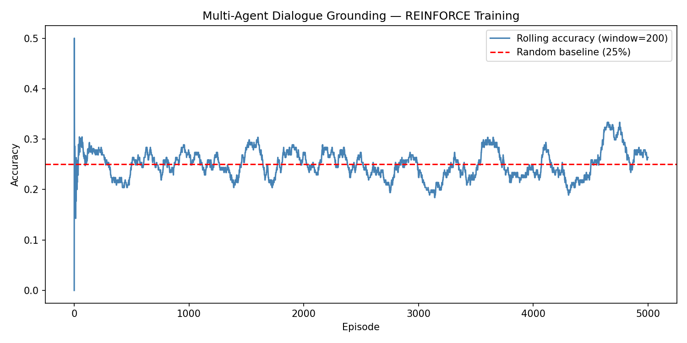

# Multi-Agent Dialogue Grounding with Reinforcement Learning
**다중 에이전트 강화학습을 이용한 대화 그라운딩**

---

## Overview | 개요

This project implements cooperative Multi-Agent Reinforcement Learning (MARL) for a referential communication task — a foundational problem in **dialogue grounding**.

이 프로젝트는 **대화 그라운딩(Dialogue Grounding)**의 핵심 문제인 참조 소통 태스크(referential communication task)를 협력적 다중 에이전트 강화학습(MARL)으로 구현합니다.


---

## Background | 이론 배경

### 1. Reinforcement Learning (RL) | 강화학습

Reinforcement Learning is a paradigm where an **agent** learns to maximize cumulative **reward** by interacting with an **environment**.

강화학습은 **에이전트**가 **환경**과 상호작용하면서 누적 **보상**을 최대화하는 행동을 스스로 학습하는 방법입니다.

**Core concepts | 핵심 개념:**

| Term | Definition | 설명 |
|------|-----------|------|
| State *s* | Current situation observed by the agent | 에이전트가 관찰하는 현재 상황 |
| Action *a* | Decision made by the agent | 에이전트가 선택하는 행동 |
| Reward *r* | Scalar feedback signal after an action | 행동 후 받는 점수 |
| Policy *π* | Mapping from states to actions | 상태를 보고 행동을 결정하는 함수 |

The goal is to find a policy *π* that maximizes the **expected return**:

정책 *π*의 목표는 **기대 누적 보상**을 최대화하는 것입니다:

```
J(π) = 𝔼[Σ γᵗ rₜ]
```

where *γ ∈ [0,1]* is the discount factor controlling how much future rewards matter.

*γ*는 미래 보상을 얼마나 중요하게 볼지 결정하는 할인 인수(discount factor)입니다.

---

### 2. Multi-Agent Reinforcement Learning (MARL) | 다중 에이전트 강화학습

In MARL, **multiple agents** act simultaneously in a shared environment. Each agent's actions affect the others.

MARL에서는 **여러 에이전트**가 공유 환경에서 동시에 행동하며, 각 에이전트의 행동이 다른 에이전트에게 영향을 미칩니다.

**Types of MARL settings | MARL 유형:**

- **Cooperative (협력)**: Agents share the same reward. They must learn to work together. *(This project)*
  - 에이전트들이 같은 보상을 공유. 함께 협력하는 전략을 학습해야 함. *(본 프로젝트)*
- **Competitive (경쟁)**: One agent's gain is another's loss (e.g., chess, poker).
  - 한 에이전트의 이득이 다른 에이전트의 손해 (예: 바둑, 포커)
- **Mixed (혼합)**: Combination of cooperation and competition.
  - 협력과 경쟁이 혼재하는 현실 세계의 대부분의 상황

**Why MARL for dialogue? | 왜 대화에 MARL을 쓸까?**

Large Language Models (LLMs) still struggle with reliable **reasoning**, **planning**, and **grounding** — especially in smaller models with limited parameters. MARL offers a promising alternative to RLHF for small LMs: by decomposing complex tasks into specialized agents, each responsible for a sub-task (grounding, reasoning, or planning), the system can overcome individual model limitations through cooperation.

LLM은 신뢰할 수 있는 **추론**, **계획**, **그라운딩**에서 여전히 한계를 보입니다 — 특히 파라미터 수가 적은 소형 모델에서 두드러집니다. MARL은 복잡한 태스크를 전문화된 에이전트들로 분해함으로써 — 각 에이전트가 그라운딩, 추론, 계획 중 하나를 담당 — 개별 모델의 한계를 협력으로 극복할 수 있는 유망한 대안입니다.

---

### 3. REINFORCE (Policy Gradient) | 정책 경사법

REINFORCE is a foundational policy gradient algorithm. The key idea: **increase the probability of actions that led to high rewards, and decrease the probability of actions that led to low rewards.**

REINFORCE는 기본적인 정책 경사(policy gradient) 알고리즘입니다. 핵심 아이디어: **높은 보상으로 이어진 행동의 확률은 높이고, 낮은 보상으로 이어진 행동의 확률은 낮춥니다.**

**The gradient update | 경사 업데이트:**

```
∇J(θ) = 𝔼[ ∇log π_θ(a|s) · G ]
```

where *G* is the return (total reward) from that episode.

*G*는 에피소드에서 받은 총 보상(return)입니다.

**In code | 코드로 보면:**
```python
loss = -(log_prob * reward).mean()
# Minimizing this loss = maximizing expected reward
# 이 loss를 최소화 = 기대 보상 최대화
```

**Why batching matters | 배치가 중요한 이유:**

A single episode has high **variance** — lucky or unlucky outcomes can mislead the gradient. Batching 64 episodes and averaging stabilizes training significantly.

에피소드 1개만 보면 **분산(variance)**이 너무 커서 운에 의한 결과가 학습 방향을 왜곡합니다. 64개 에피소드를 묶어 평균내면 안정적으로 수렴합니다.

```python
# Reward normalization | 보상 정규화
rewards = (rewards - rewards.mean()) / (rewards.std() + 1e-8)
# 배치 내에서 상대적 품질 비교: 평균보다 잘한 행동 → 양수, 못한 행동 → 음수
```

---

### 4. Dialogue Grounding | 대화 그라운딩

**Grounding** is the process by which conversational participants establish and confirm **mutual understanding**.

**그라운딩**은 대화 참여자들이 **상호 이해**를 구축하고 확인하는 과정입니다.

When you say "bring me the apple" — does the other person understand the same apple you mean? The process of aligning this shared meaning is grounding.

"사과 가져와"라고 했을 때 — 상대방이 당신이 의미하는 그 사과를 이해하는가? 이 공유된 의미를 맞춰가는 과정이 그라운딩입니다.

**Referential Communication Game | 참조 소통 게임:**

This project implements grounding as a referential game:

본 프로젝트는 그라운딩을 참조 게임으로 구현합니다:

```
Speaker sees:  [🍎 🌟 🐱 🎸]  target = 🍎
Speaker sends: message token → e.g., token[3]
Listener sees: token[3] + [🍎 🌟 🐱 🎸]
Listener picks: 🍎  →  reward = +1 ✓
```

No language is pre-defined. The agents develop a **shared communication code** purely from the reward signal — this is called **Emergent Communication**.

사전에 합의된 언어가 없습니다. 에이전트들은 오직 보상 신호만으로 **공유 소통 코드**를 만들어냅니다 — 이를 **창발적 소통(Emergent Communication)**이라고 합니다.

---

## Architecture | 아키텍처

```
Speaker Policy (MLP):
  Input:  target index (embedded)
  Output: message token (discrete, vocab_size)
  
Listener Policy (MLP):
  Input:  message token (embedded)
  Output: candidate selection (num_candidates)

Training: Batched REINFORCE, shared cooperative reward
```

Both agents use **embedding layers** to represent discrete inputs, followed by a 2-layer MLP producing a softmax distribution over actions.

두 에이전트 모두 이산(discrete) 입력을 표현하기 위해 **임베딩 레이어**를 사용하고, 2층 MLP로 행동에 대한 softmax 분포를 출력합니다.

---

## Results | 결과

| Setting | Random Baseline | Trained Agents |
|---------|----------------|----------------|
| 4 candidates, vocab=8 | 25% | **~100%** |

Agents converge in ~100 batches (6,400 episodes), learning a stable emergent communication protocol.

에이전트들은 약 100배치(6,400 에피소드) 만에 수렴하며, 안정적인 창발적 소통 프로토콜을 학습합니다.



---

## Installation & Usage | 설치 및 실행

```bash
pip install torch numpy matplotlib
python train.py
```

---

## References | 참고문헌

- Lazaridou et al. (2017). *Multi-Agent Cooperation and the Emergence of Natural Language.* ICLR.
- Mordatch & Abbeel (2018). *Emergence of Grounded Compositional Language in Multi-Agent Populations.* AAAI.
- Williams (1992). *Simple Statistical Gradient-Following Algorithms for Connectionist Reinforcement Learning.* Machine Learning.
- Ziegler et al. (2019). *Fine-Tuning Language Models from Human Preferences.* (RLHF)
